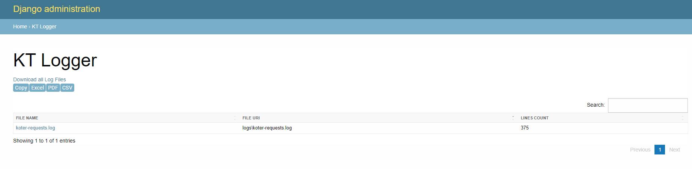
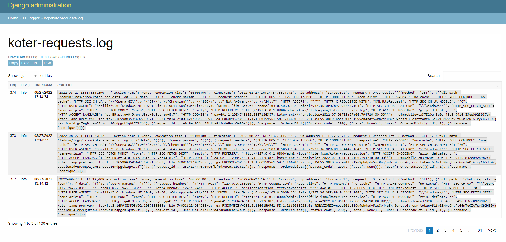

# KT Logger
KT Logger allows you to read and download log files from the Django admin page.
KT Logger is based on Django Log Viewer.

[](https://www.buymeacoffee.com/riquedevbr)

## License

[MIT](LICENSE)


## Screenshots




## Running locally (pip)
- Coming soon

## Running locally (Git)

Clone the project

```bash
  git clone https://link-para-o-projeto
```

Enter the project directory

```bash
  cd KTLogger
```

Install the dependencies

```bash
  python setup.py install
```

Add "KTLogger" and "ajax_datatable" to your "INSTALLED_APPS"

```python
INSTALLED_APPS = [   
    ...,    
    'KTLogger',
    'ajax_datatable',
]
```

Add the urls
```python
from django.urls import path, include
urlpatterns = [
    ...,
    path("kt-logs/", include("KTLogger.urls"))
]
```

## Settings

Currently the variables available for configuration are:

```python
import re
KT_LOG_VIEWER_FILES_PATTERN = ["*.log*"]
KT_LOG_VIEWER_FILES_DIR = ["logs/"]
KT_LOG_VIEWER_MAX_READ_LINES = 100
KT_LOG_VIEWER_PATTERNS = ['[INFO]', '[DEBUG]', '[WARNING]', '[ERROR]', '[CRITICAL]']
KT_LOG_LEVEL_PATTERN = {
    "INFO": re.compile(r'(\[INFO])', flags=re.IGNORECASE),
    "DEBUG": re.compile(r'(\[DEBUG])', flags=re.IGNORECASE),
    "WARNING": re.compile(r'(\[WARNING])', flags=re.IGNORECASE),
    "ERROR": re.compile(r'(\[ERROR])', flags=re.IGNORECASE),
    "CRITICAL": re.compile(r'(\[CRITICAL])', flags=re.IGNORECASE),
}
KT_LOG_VIEWER_EXCLUDE_TEXT_PATTERN = None

```

## Improvements

As mentioned in the description, this project is based on "Django Log Viewer" and I felt the need to do it in an internal project, so I decided to publish it here.
The main improvement I tried to aim for was performance and the possibility of adding new keys to the logs, in addition to the filter and search options provided by ajax_datatables.
